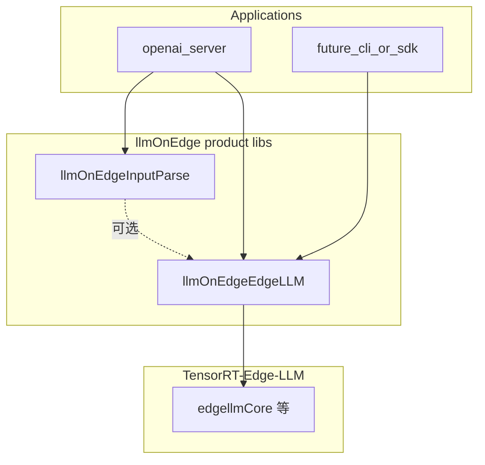

# edgeLLM：端侧推理核心库（`src/edgeLLM`）设计

本文档描述在 **llmOnEdge** 仓库 `src/edgeLLM` 下实现端侧推理核心库的**基本框架**，用于把引擎生命周期、CUDA 流、插件加载、线程模型等收拢到一处；HTTP / OpenAI 协议等上层只依赖稳定 API。

当前现状参考：`src/openai_server/llm_session.cpp` 直接使用 `trt_edgellm::rt::LLMInferenceRuntime`。

---

## 1. 定位与边界

| 层次 | 职责 | 归属 |
|------|------|------|
| **edgeLLM（本库）** | 端侧推理对外 API：加载配置、创建会话、执行生成、可选指标/系统提示 KV 等；封装 TensorRT-Edge-LLM 细节 | `src/edgeLLM` |
| **TensorRT-Edge-LLM** | 真实 `LLMInferenceRuntime`、`LLMGenerationRequest` / `LLMGenerationResponse` 等 | `third_party/TensorRT-Edge-LLM` |
| **openai_server / 其它入口** | HTTP、OpenAI JSON、与 `llm_input_parse` 的衔接 | `src/openai_server` 等 |

**原则**：edgeLLM 是产品侧**唯一建议**链接 `edgellmCore` 等 TensorRT-Edge-LLM CMake 目标的库；上层尽量只依赖 edgeLLM 的公共头文件与少量类型别名（或 PIMPL），避免在多个可执行文件里重复插件加载、stream、互斥锁等逻辑。

---

## 2. 建议目录结构

```text
src/edgeLLM/
├── CMakeLists.txt                 # add_library(llmOnEdgeEdgeLLM ...) + 依赖 edgellmCore 等
├── include/llm_on_edge/edge_llm/  # 对外公共 API（target PUBLIC include）
│   ├── edge_llm.h                 # 聚合 include（可选）
│   ├── config.h                   # EdgeLlmConfig / 从路径或后续 JSON 构建
│   ├── session.h                  # EdgeLlmSession 主入口（推荐 PIMPL）
│   ├── result.h                   # 统一错误码 / Status（可选）
│   └── forward.h                  # typedef / 前向：是否暴露 trt 类型由实现阶段决定
├── src/
│   ├── session.cpp                # PIMPL：内部持有 LLMInferenceRuntime + stream + mutex
│   ├── plugin_loader.cpp          # std::call_once + loadEdgellmPluginLib（可从 openai 迁出）
│   └── config.cpp                 # 配置解析、默认值
└── internal/                      # 不对外安装的头文件（detail）
    ├── session_impl.h             # 若不用独立头文件则可与 session.cpp 同文件
    └── trt_aliases.h            # using / 包装 trt_edgellm 类型，减少上层直接 include 深度
```

命名空间建议与现有 `llm_on_edge::openai` 对齐，例如：**`llm_on_edge::edge_llm`**（或简写 `llm_on_edge::llm`，全仓库统一即可）。

---

## 3. 分层与模块职责

### 3.1 `config`（配置）

- 字段与当前 `LlmEngineSession` 构造函数对齐并扩展：`engine_dir`、`multimodal_engine_dir`、`lora_weights_map`。
- 后续可加分项：`enable_cuda_graph`、`cuda_device_id`、日志级别、引擎校验策略等。
- 第一版可采用 **纯 C++ 结构体 + 工厂函数**；JSON/YAML 按需再引入，避免过早绑定格式。

### 3.2 `plugin_loader`（全局一次性初始化）

- 将 `ensurePluginsLoaded()`（`loadEdgellmPluginLib`）迁入 edgeLLM，在 **`EdgeLlmSession` 首次构造**或显式 **`edge_llm::initialize()`** 中调用一次。
- 对外可暴露 `void ensure_edge_llm_plugins_loaded();`，便于单测或 CLI 预加载。

### 3.3 `EdgeLlmSession`（会话 / 运行时门面）

- **内部**：`std::unique_ptr<trt_edgellm::rt::LLMInferenceRuntime>`、`cudaStream_t`、`std::mutex`（与现逻辑一致：多线程下序列化 `handleRequest`）。
- **构造**：接受 `EdgeLlmConfig`（或等价参数）；创建 stream → 构造 runtime → 可选 `captureDecodingCUDAGraph`。
- **接口（第一版可薄封装）**：
  - `bool generate(LLMGenerationRequest const&, LLMGenerationResponse&, ...)`；若希望完全隐藏 CUDA，可固定使用内部 stream，不对外暴露 `cudaStream_t`。
  - 可按需透传 `genAndSaveSystemPromptKVCache`、`getPrefillMetrics` / `getGenerationMetrics` 等，或延后到第二版。
- **析构顺序**：先销毁 runtime，再 `cudaStreamDestroy`，与当前 `LlmEngineSession` 一致。

### 3.4 类型策略（是否暴露 TRT 类型）

1. **薄包装（推荐起步）**  
   公共 API 仍使用 `trt_edgellm::rt::LLMGenerationRequest` / `LLMGenerationResponse`，edgeLLM 负责 session 与插件；上层继续 include TRT 头。CMake 上对依赖方 `PUBLIC` 传递所需 include。

2. **稳定边界（长期）**  
   在 `edge_llm` 内定义自有 `GenerationRequest` / `Response`，在 `session.cpp` 与 TRT 类型互转；协议层只依赖 edgeLLM，升级 TRT 时改动集中。

第一版宜采用 **方案 1**；在 `forward.h` 中用 `using` 集中别名，便于日后迁移到方案 2。

### 3.5 错误与日志（可选）

- `result.h`：`enum class EdgeLlmError` + 消息，或项目统一错误类型。
- 日志复用 TensorRT-Edge-LLM 的 `LOG_*`，edgeLLM 仅增加可区分的前缀/模块名，避免双套日志体系。

---

## 4. CMake 与工程集成

- 根目录 `CMakeLists.txt` 增加 `add_subdirectory(src/edgeLLM)`（建议在 `third_party/TensorRT-Edge-LLM` 之后、其它业务 `src` 之前或与之并列）。
- 目标名建议：**`llmOnEdgeEdgeLLM`**（与 `llmOnEdgeInputParse` 命名风格一致）。
- `target_link_libraries` / `target_include_directories` 参考 `src/openai_server/CMakeLists.txt`：`edgellmCore`、`edgellmTokenizer`、`exampleUtils`、`commonLibraryExt` 等，按 runtime 实际需要裁剪。
- `openai_server` 改为链接 `llmOnEdgeEdgeLLM`；`LlmEngineSession` 可删除或薄委托给 `EdgeLlmSession`，减少重复。

---

## 5. 依赖关系（示意）



说明：`llm_input_parse` 若仅负责 token/JSON，可不依赖 edgeLLM；「文本 → 一次 generate」的编排放在 HTTP 层或单独 orchestration 模块时再引入依赖。

---

## 6. 后续扩展（非第一版必选）

- **设备与多实例**：`EdgeLlmDevice` 封装 `cudaSetDevice`，每卡一个 `EdgeLlmSession` 或会话池。
- **异步 API**：内部 stream + callback / future；文档中明确与 runtime 互斥策略是否允许并行。
- **测试**：对 `config`、插件仅加载一次等编写 gtest；会话层可做集成测试，runtime 可测时再考虑 mock。

---

## 7. 小结

- **核心交付物**：静态库 **`llmOnEdgeEdgeLLM`** + **`EdgeLlmConfig`** + **`EdgeLlmSession`（PIMPL）** + **插件一次性加载**，将现有 `LlmEngineSession` 逻辑迁入 `src/edgeLLM`。
- **类型**：首版 **薄封装 TRT 请求/响应**；稳定后再考虑自有 DTO。
- **集成**：单独 CMake 目标，供 `openai_server` 与未来端侧 SDK 链接。

---

## 8. 相关文档

- 上游能力与术语：[`docs/trt-edge-llm.md`](trt-edge-llm.md)
