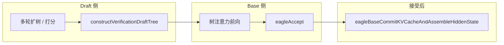

# `cpp/kernels/speculative`：推测解码（EAGLE）辅助内核说明

本文说明 **TensorRT-Edge-LLM** 中 **`third_party/TensorRT-Edge-LLM/cpp/kernels/speculative`** 目录的职责、各模块实现要点，以及相对 CPU/朴素实现的优点。路径相对于 **llmOnEdge** 仓库根目录。

该目录服务于 **EAGLE 类推测解码** 运行时（见 `cpp/runtime/llmInferenceSpecDecodeRuntime.cpp`、`eagleDraftEngineRunner.*`）：由 **Draft** 模型提议 **树形候选 token**，**Base** 模型做 **验证（accept）**，从而在保持质量的前提下 **减少大模型前向次数**、提高吞吐。

---

## 1. 目录结构与文件

| 文件 | 作用 |
|------|------|
| **`eagleUtilKernels.h` / `.cu`** | **体量最大**：在 GPU 上准备各阶段的 **attention mask**（打包位图或 TRT Native 布尔大图）、**position / tensorPositionIndices**、**sequenceContextLengths**、**gather 用 selectTokenIndices**；**构造草稿树**（多轮 `draftTopK`、全表 `draftId/Score/Parent`）；**验证树**的 `inputIds` + `draftTreeMask`；**accept 后** 的 KV 重排与 hidden **原地紧凑**。 |
| **`eagleAcceptKernels.h` / `.cu`** | **`eagleAccept`**：给定 base 模型 **logits**、草稿 **tokenIds** 与树 **attentionMask**，在设备上完成 **accept 算法**（top-1 与树一致性检查），输出接受的 token 及对应 logits 下标。 |
| **`batchEvictKernels.h` / `.cu`** | **`compactKVCache`** / **`compactTensorBatch`**：按 **batch 驱逐映射** 将 KV 与通用张量在 **batch 维** 上 **压缩到连续槽位**，供动态 batch 场景复用缓冲区。 |

---

## 2. 整体数据流（概念）

- **Draft**：维护 **草稿词表 → 全词表** 映射、**累积 log 分数**、**父指针**，最终为 base 构造 **验证树**（`inputIds` + `draftTreeMask`）。
- **Base**：对树中节点算 **logits**；**`eagleAccept`** 用 **top-1 预测** 与 **树结构 + mask** 对齐，得到 **接受长度** 与 **接受的 token / 索引**。
- **提交**：将 KV 中「按树位置散落」的接受项 **压缩到序列前缀连续位置**，并把 **hidden** 从 `[batch, verify_tokens, dim]` **原地** 压到 `[batch, max_accept_depth, dim]`（依赖 **max_accept_depth ≪ verify_tokens** 避免读写重叠）。

---

## 3. `eagleUtilKernels`：实现原理与作用

### 3.1 两类 attention 接口

- **打包树 mask（`int32` 位图）**：每个节点一行，用 **32bit 字** 存可见祖先/同伴关系（`assembleDraftTreeDescKernel` 等），适配 **树注意力插件** 的紧凑输入。
- **TRT Native 布尔 mask（`bool*`）**：形状如 `[batch, 1, Q, present_len]`，显式 **历史全可见 + 树内按 mask** + **padding 行清零**；**padding 的 `tensorPositionIndices` 置 -1**（`assembleCasualTreeAndSelectIndicesKernel`）以便 **RoPE 写 KV** 等内核 **跳过无效 token**。

同一语义在 **`prepareEagle*TrtNative`** 与 **`prepareEagle*`**（非 Native）两条路径各实现一遍，便于不同 **Base 引擎**（是否原生带 mask 输入）切换。

### 3.2 序列长度与 gather 下标

- **`sequenceContextLengths`**：常取 **`sequenceStart + 树/接受段填充长度`**，使 **KV 可见长度** 与 **树注意力 kernel** 中 context K 的范围一致（代码注释中说明了 **用 padded 长度对齐 Q/K 窗口** 的原因）。
- **`selectTokenIndices`**：指明从 **引擎输出的 hidden/logits** 里 **取哪一维 token** 供下一轮 draft 或采样（如 draft proposal 取「当前轮」对应位置）。

### 3.3 草稿树构造（EAGLE3 风格）

- **`initializeDraftTreeTables`**：根节点、第一层 **topK**、**vocabMappingTable** 映射到全词表 id，**score** 与 **parent** 全表初始化（空节点 `-INFINITY` / 哨兵父下标）。
- **多轮**：**`computeCuScoresAndTranslateToken`** 在 **父分数 + 子 logprob** 上累加；**`updateDraftTreeFullTables`** 把 **K×K** 块写入 **大表** 固定槽位；**`assembleDraftTreeInput`** 根据 **父 mask 继承** 再 **置自身可见**，并搬运 **hidden**（**`assembleDraftHiddenStatesKernel`** 用 **`DVec<half>` 向量化**）。
- **`constructVerificationDraftTree`**：对每条验证序列位置，沿 **parent 链** 回溯，再在 **verify 序列** 里对齐 **祖先可见性**，填 **行 mask**（小表可走 **寄存器数组 `kMAX_DEPTH`**，注释说明数据小靠 **L1**）。

### 3.4 Accept 后 KV 与 Hidden

- **`eagleBaseCommitKVCacheAndAssembleHiddenState`**：  
  - KV：**两阶段** 先把接受索引对应位置 **读到线程局部 `tempBuffer`**，再 **顺序写回** 前缀（支持 **FP16 / FP8** KV，`HEAD_DIM` 仅 **64/128**）。  
  - Hidden：**按 accept 下标 gather** 再 **写到紧凑前缀**（**`maxDepth` 上限**，如 **8**）。

---

## 4. `eagleAcceptKernels`：实现原理与优点

**`eagleAccept`**（见头文件文档注释）输入 **展平 logits** `[batch*num_tokens, vocab]`（FP32）、**tokenIds**、**attentionMask**，输出 **接受的 token id**、**logits 列下标**、**acceptLength**。

**两阶段设计**（降低共享内存与寄存器压力）：

1. **`eagleComputeTop1Kernel`**：每个 **(batch, token)** 一个 block，对 **vocab 维** 做 **CUB `BlockReduce`** 求 **top-1**；可选 **`vocabMappingTable`** 将 **裁剪词表下标** 映到 **全词表**。
2. **`eagleAcceptKernel`**：每 **batch** 一个 block；**并行预计算各 token 深度**（mask 行和）；再 **逐步** 取当前位置 top-1，在树中 **用 atomicMin 找下一节点**（满足深度与 mask），直到无法延续。

**优点**：**不把整 logits 驻留 shared memory**；top-1 与树遍历 **解耦**；batch 间 **天然并行**；适合 **边侧 GPU** 上低延迟实现 accept。

**Workspace**：`getEagleAcceptWorkspaceSize` 主要为 **top1Tokens** 缓冲，要求 **256 字节对齐**。

---

## 5. `batchEvictKernels`：实现原理与优点

- **`compactKVCache`**：按 **`batchMapping[old] -> new`**（**-1** 表示驱逐）在 **6D KV** `[L, maxB, 2, H, S, D]` 上 **按层/按 K/V/head** 分 CTA，**向量搬运**（`DVec`，**headDim 64/128**），并 **更新** `kvCacheLengths`。
- **`compactTensorBatch`**：首维为 batch 的任意张量，按映射 **元素级** 拷贝到新 batch 下标（支持 **in-place** `src==dst`）。

**作用**：请求结束后 **回收 batch 槽**，使 **活跃 batch 下标连续**，提高 **后续步** 的 **SM 利用率** 与 **访存合并**，避免「空洞 batch」长期占用 **KV 与状态缓冲区**。

---

## 6. 归纳：优点一览

| 维度 | 说明 |
|------|------|
| **端到端 GPU 化** | 树 mask、位置、长度、草稿表、验证树、accept、KV/hidden 整理均在 **CUDA** 完成，减少 **CPU 同步与 H2D 小拷贝**。 |
| **与 TRT 图协同** | 同时支持 **打包树 mask** 与 **TRT Native 大布尔 mask**，适配不同 **AttentionPlugin / 原生 mask** 路径。 |
| **内存与正确性** | **Padding** 显式 **mask 全 0**、**position -1**，避免 **RoPE/KV 写错槽**；accept 后 **KV 两阶段** 避免 **原位覆盖** 未读数据。 |
| **吞吐** | **`eagleAccept`** 两阶段 + **CUB**；**compact** 向量化搬 KV；draft 侧 **向量化 hidden** 组装。 |
| **可维护边界** | 多处 **静态断言**（如 `bool` 与 `uint8` 同宽）、**maxAcceptedTokenNum &lt; 32**、**verifyTreeSize ≤ 128**、**headDim** 枚举，便于在 **固定硬件** 上控制资源。 |

---

## 7. 相关代码索引

| 位置 | 说明 |
|------|------|
| `cpp/runtime/llmInferenceSpecDecodeRuntime.cpp` | 调用上述 kernel，编排 **spec decode** 主循环 |
| `cpp/plugins/attentionPlugin/` | **树注意力**（`enable_tree_attention`）与推测解码配合 |
| `cpp/kernels/posEncoding/applyRopeWriteKV.cu` | **spec decode** 下 **序列下标与 KV 槽** 非平凡对应 |

实现细节以 **`third_party/TensorRT-Edge-LLM/cpp/kernels/speculative/*.cu`** 为准；若子模块与 **llmOnEdge** 内 **`third_party/TensorRT-Edge-LLM`** 同步，二者应一致。
