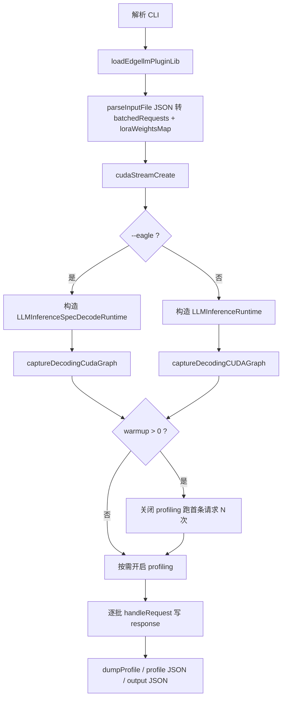

# `llm_inference.cpp`：示例程序中的 LLM 推理流程与技术点

本文分析 TensorRT-Edge-LLM 示例 `third_party/third_party/TensorRT-Edge-LLM/examples/llm/llm_inference.cpp`：它**不是**引擎内核实现，而是命令行驱动的 **端到端推理壳程序**，串联插件加载、JSON 请求解析、运行时构造、`handleRequest` 批处理、可选 **CUDA Graph** 捕获、性能剖析与结果落盘。

---

## 1. 程序职责一览

| 职责 | 说明 |
|------|------|
| CLI | `getopt_long` 解析引擎目录、多模态引擎目录、输入/输出 JSON、warmup、EAGLE 参数、batch 覆盖等 |
| 输入 | 从 JSON 读取多请求，按 `batch_size` 打成多个 **`LLMGenerationRequest`** |
| 运行时 | **二选一**：标准 `LLMInferenceRuntime` 或 EAGLE 路径 `LLMInferenceSpecDecodeRuntime` |
| 执行 | 在同一条 **`cudaStream`** 上反复调用 `handleRequest`（warmup + 正式推理） |
| 观测 | 可选 NVTX 区间、内置 profiling 指标、`MemoryMonitor`、控制台/JSON 性能摘要 |
| 输出 | 推理文本写入输出 JSON；失败时写入占位错误文案并对 UTF-8 做清洗 |

真正的 **Prefill/Decode 循环、KV、TensorRT enqueue、采样** 等均在运行时类内部完成；本文件只负责 **装配与调度**。

---

## 2. 端到端流程（与源码顺序对齐）

下列步骤对应 `main` 及关键调用的自然顺序，便于对照阅读源码。



### 2.1 入口与全局观测

- 使用 **`NVTX_SCOPED_RANGE`** 包裹整个 `main`，便于 Nsight Systems 等工具在时间轴上看到 `llm_inference` 区间（见文件头部 include 与 `main` 起始处）。
- 若开启 `--dumpProfile`，会启动 **`MemoryMonitor`**，在剖析结束时汇总显存相关指标。

```632:652:third_party/TensorRT-Edge-LLM/examples/llm/llm_inference.cpp
int main(int argc, char* argv[])
{
    NVTX_SCOPED_RANGE(nvtx_main, "llm_inference");
    LLMInferenceArgs args;
    if (!parseLLMInferenceArgs(args, argc, argv))
    {
        printUsage(argv[0]);
        return EXIT_FAILURE;
    }
    // ...
    bool profilerEnabled = args.dumpProfile;
    MemoryMonitor memoryMonitor;
    // Start memory monitoring at the beginning if profiling is enabled
    if (profilerEnabled)
    {
        memoryMonitor.start();
    }
```

### 2.2 加载 TensorRT 插件

在解析输入之前调用 **`loadEdgellmPluginLib()`**（来自 `common/trtUtils.h`），将 Edge-LLM 自带的 **TensorRT 自定义插件**（如 Attention、INT4 GEMM 等）注册进 TensorRT，后续加载的 engine 才能解析图中插件节点。

```654:655:third_party/TensorRT-Edge-LLM/examples/llm/llm_inference.cpp
    auto pluginHandles = loadEdgellmPluginLib();
    // load input file and parse to requests
```

### 2.3 输入 JSON → 批请求

**`parseInputFile`** 完成三件大事：

1. **全局采样与模板开关**（可被 CLI 覆盖的仅 `batch_size`、`max_generate_length`）：`temperature`、`top_p`、`top_k`、`apply_chat_template`、`add_generation_prompt`、`enable_thinking` 等。
2. **`available_lora_weights`**：名称到 safetensors 路径的映射，供运行时加载；每条请求可选 **`lora_name`**，且**同一 batch 内必须同名**（代码显式校验）。
3. **`requests` 数组**：按 `batch_size` 切分为多个 **`rt::LLMGenerationRequest`**，每个子请求含 `messages`，支持纯文本字符串或 **多模态数组**（`text` / `image` / `audio`）。

安全方面：对 batch 上限、单请求消息条数、单条 content 大小、多模态块数量等使用 **`limits::security`** 常量做前置拒绝，避免恶意超大输入拖垮进程（见 `common/inputLimits.h` 注释）。

多模态与音频：

- **图像**：`type == "image"` 时用 **`rt::imageUtils::loadImageFromFile`** 读入，像素缓冲放入 **`imageBuffers`**，与 `messages` 中顺序对应。
- **音频**（如 Qwen3-Omni 场景）：仅支持 **`.safetensors` 梅尔谱** 路径，填入 **`audioBuffers`**；其它扩展名会打 warning。

```336:630:third_party/TensorRT-Edge-LLM/examples/llm/llm_inference.cpp
std::pair<std::unordered_map<std::string, std::string>, std::vector<rt::LLMGenerationRequest>> parseInputFile(
    std::filesystem::path const& inputFilePath, int32_t batchSizeOverride = -1, int64_t maxGenerateLengthOverride = -1)
{
    // ... JSON parse, limits, LoRA map, batching, messages -> LLMGenerationRequest ...
    return std::make_pair(std::move(loraWeightsMap), std::move(batchedRequests));
}
```

### 2.4 CUDA 流与运行时构造

- 创建 **`cudaStream_t`**，全程序共享，保证同一流上的 engine 执行与 runtime 侧 kernel（如采样）顺序一致。
- **EAGLE 模式**：构造 **`LLMInferenceSpecDecodeRuntime`**，传入 `EagleDraftingConfig`（`draftTopK` / `draftStep` / `verifyTreeSize`），对应投机解码树形草稿与 base 验证规模。
- **标准模式**：构造 **`LLMInferenceRuntime`**，单引擎自回归路径。

两者构造参数均包含 **`engineDir`**、可选 **`multimodalEngineDir`**、**`loraWeightsMap`** 与 **`stream`**。

```677:721:third_party/TensorRT-Edge-LLM/examples/llm/llm_inference.cpp
    // Create runtime based on mode
    std::unique_ptr<rt::LLMInferenceRuntime> llmInferenceRuntime{nullptr};
    std::unique_ptr<rt::LLMInferenceSpecDecodeRuntime> eagleInferenceRuntime{nullptr};
    cudaStream_t stream;
    CUDA_CHECK(cudaStreamCreate(&stream));

    if (args.eagleArgs.enabled)
    {
        rt::EagleDraftingConfig draftingConfig{
            args.eagleArgs.draftTopK, args.eagleArgs.draftStep, args.eagleArgs.verifyTreeSize};
        // ...
            eagleInferenceRuntime = std::make_unique<rt::LLMInferenceSpecDecodeRuntime>(
                args.engineDir, args.multimodalEngineDir, loraWeightsMap, draftingConfig, stream);
        // ...
        if (!eagleInferenceRuntime->captureDecodingCudaGraph(stream))
        {
            LOG_WARNING(
                "Failed to capture CUDA graph for Eagle decoding usage, proceeding with normal engine execution.");
        }
    }
    else
    {
        // Standard mode
        // ...
            llmInferenceRuntime = std::make_unique<rt::LLMInferenceRuntime>(
                args.engineDir, args.multimodalEngineDir, loraWeightsMap, stream);
        // ...
        if (!llmInferenceRuntime->captureDecodingCUDAGraph(stream))
        {
            LOG_WARNING("Failed to capture CUDA graph for decoding usage, proceeding with normal engine execution.");
        }
    }
```

### 2.5 Decode 阶段 CUDA Graph 捕获

初始化成功后，示例会主动调用：

- 标准：**`captureDecodingCUDAGraph`**
- EAGLE：**`captureDecodingCudaGraph`**

失败时**仅告警**，后续仍走普通 engine 执行路径。图捕获的具体策略（按 batch/形状/LoRA 多图等）在 **`LLMEngineRunner`** 内实现，示例层只负责触发一次。

### 2.6 Warmup 与 Profiling 开关

- Warmup 前 **`setProfilingEnabled(false)`**，避免把 JIT、缓存热身算进正式指标。
- Warmup 用 **第一条批请求** 重复执行 `handleRequest`。
- 正式跑批前若 `--dumpProfile`，再 **`setProfilingEnabled(true)`**。

```723:756:third_party/TensorRT-Edge-LLM/examples/llm/llm_inference.cpp
    if (args.warmup > 0)
    {
        // Disable profiling for warmup runs
        setProfilingEnabled(false);
        // ...
        for (int32_t warmupRun = 0; warmupRun < args.warmup; ++warmupRun)
        {
            rt::LLMGenerationResponse warmupResponse;
            // ... handleRequest ...
        }
        // ...
    }

    if (profilerEnabled)
    {
        setProfilingEnabled(true);
    }
```

### 2.7 主循环：`handleRequest` 与结果汇总

对每个 **`batchedRequests[i]`**：

1. 调用对应 runtime 的 **`handleRequest(request, response, stream)`**。
2. 成功时可选 **`--dumpOutput`** 打印 `response.outputTexts`。
3. 无论成功与否，按 **batch 内每条子请求** 构造 JSON：`output_text`（失败时为固定错误句）、`request_idx`、`batch_idx`、回显 `messages`，以及运行时填写的 **`formatted_system_prompt` / `formatted_complete_request`**（用于对齐 chat template 后的实际字符串）。
4. 输出文本经 **`sanitizeUtf8ForJson`** 再写入 JSON，避免非法 UTF-8 破坏文件。

```767:855:third_party/TensorRT-Edge-LLM/examples/llm/llm_inference.cpp
    for (size_t requestIdx = 0; requestIdx < batchedRequests.size(); ++requestIdx)
    {
        auto& request = batchedRequests[requestIdx];
        rt::LLMGenerationResponse response;
        // ...
        if (args.eagleArgs.enabled)
        {
            requestStatus = eagleInferenceRuntime->handleRequest(request, response, stream);
        }
        else
        {
            requestStatus = llmInferenceRuntime->handleRequest(request, response, stream);
        }
        // ... dumpOutput, failure logging ...
        for (size_t batchIdx = 0; batchIdx < request.requests.size(); ++batchIdx)
        {
            // ... build responseJson, sanitizeUtf8ForJson ...
            outputData["responses"].push_back(responseJson);
        }
    }
```

**`handleRequest` 内部**（不在本文件）才包含：tokenizer、可选 ViT、TensorRT prefill/decode profile 切换、Linear KV 更新、采样 kernel、EAGLE 树验证等；示例文档若需细化到算子级，应继续阅读 `cpp/runtime/llmInferenceRuntime.*` 与 `llmEngineRunner.*`。

### 2.8 性能剖析与落盘

- **控制台**：`--dumpProfile` 时组装字符串，分别调用 `outputPrefillProfile`、`outputGenerationProfile`（标准）或 `outputEagleGenerationProfile`（EAGLE），以及 `outputMultimodalProfile`、`outputMemoryProfile`。
- **JSON**：`--profileOutputFile` 时写入 `addJsonPrefillSummary`、`addJsonGenerationSummary` / `addJsonEagleGenerationSummary`、`addJsonTimingStages`、`addJsonMemorySummary` 等聚合结果。

最后将 **`outputData`** 写入 **`--outputFile`**（pretty print）。

---

## 3. 涉及的技术栈（按类别）

| 类别 | 技术 / 组件 | 在本文件中的角色 |
|------|----------------|------------------|
| 推理引擎 | **TensorRT**（`ILogger` 日志级别随 `--debug` 切换） | Engine 由 runtime 加载；示例负责插件与流 |
| 插件 | **`loadEdgellmPluginLib`** | 注册自定义层，否则 engine 无法执行 |
| GPGPU | **CUDA Stream** | 单流贯穿请求，保证异步顺序 |
| 优化 | **CUDA Graph**（runtime 捕获） | 降低 decode 阶段 launch 开销；失败则降级 |
| 运行时 | **`LLMInferenceRuntime` / `LLMInferenceSpecDecodeRuntime`** | 标准自回归 vs **EAGLE3** 投机解码双引擎路径 |
| 适配 | **LoRA 权重映射 + per-request `lora_name`** | 多适配器注册与同 batch 一致性校验 |
| 多模态 | **图像文件加载、音频 mel `.safetensors`** | 填充 `imageBuffers` / `audioBuffers` |
| 序列化 | **nlohmann::json** | 输入/输出/ profile JSON |
| 工具链 | **NVTX** | 顶层区间标记，便于系统级 timeline |
| 观测 | **`setProfilingEnabled`、`MemoryMonitor`、metrics 聚合** | Warmup 排除 + Prefill/Generation（或 Eagle）分阶段统计 |
| 工程 | **`std::filesystem`、RAII `unique_ptr`、安全输入上限** | 路径处理、资源生命周期、防滥用 |

---

## 4. EAGLE 相关 CLI 与语义（示例层）

结构体 **`EagleArgs`** 与注释说明了三个核心超参（与官方文档中树规模公式一致）：

- **`draftTopK`**：草稿模型每步从分布中取 top-K，控制树的分支因子。  
- **`draftStep`**：草稿扩展的层数（步数）。  
- **`verifyTreeSize`**：从完整草稿树中截取、交给 **base 模型并行验证** 的节点规模上界（应不大于理论树规模）。

```66:83:third_party/TensorRT-Edge-LLM/examples/llm/llm_inference.cpp
struct EagleArgs
{
    bool enabled{false};
    // ...
    int32_t draftTopK{10};
    int32_t draftStep{6};
    int32_t verifyTreeSize{60};
};
```

---

## 5. 与自研 llmOnEdge 的对照小结

- **本文件示范的是「产品化壳层」**：插件 → 流 → 运行时 → 可选图捕获 → 批处理 API → 指标与 JSON。内核推理状态机不在此文件。  
- 若自研引擎要实现类似 CLI：**输入校验与 batch 语义、warmup 与 profiling 分离、CUDA Graph 失败降级、UTF-8 安全写出**，均可直接借鉴本示例的组织方式。  
-  deeper 的 **KV 布局、双 profile、采样实现** 需下钻 `cpp/runtime/` 与 `cpp/sampler/`，不宜仅从 `llm_inference.cpp` 推断。

---

*源码路径：`third_party/third_party/TensorRT-Edge-LLM/examples/llm/llm_inference.cpp`。*
