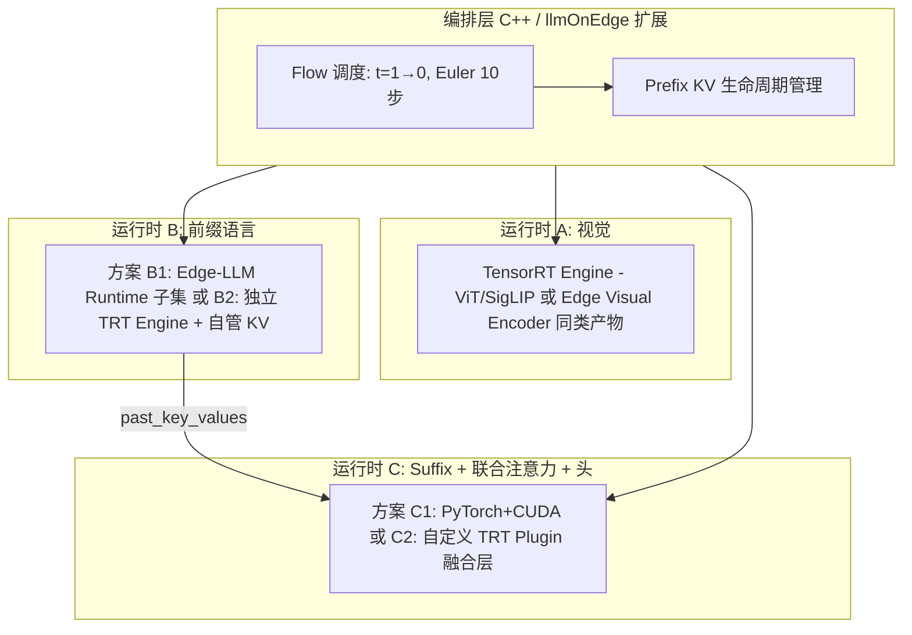

# π₀.₅（OpenPI VLA）基于 TensorRT-Edge-LLM 的部署方案设计

本文在 [pi05.md](./pi05.md) 所述模型结构之上，讨论如何**在 NVIDIA 边缘栈上落地推理**，并明确 **TensorRT-Edge-LLM（TRT-Edge-LLM）** 能承担的部分与必须**额外工程**的部分。目标读者：要把 **ViT + LLM + flow-matching** 三要素推到端侧、且希望尽量复用 Edge-LLM 工具链的团队。

---

## 1. 先对齐预期：TRT-Edge-LLM 是什么、不是什么

根据 [trt-edge-llm.md](./trt-edge-llm.md)：

- **强项**：官方维护的 **HF → ONNX → Engine → C++ Runtime** 闭环，覆盖特定 **LLM / VLM** 族（如 Qwen-VL、InternVL、Phi-4-Multimodal 等），含 **Visual Encoder Builder**、**双 Profile（Prefill/Decode）**、**Linear KV**、**CUDA Graph decode**、量化与插件生态。
- **弱项 / 边界**：**不**保证对任意 PyTorch 结构（尤其是 **魔改 Transformers + 双塔每层拼接 QKV 的联合注意力**）开箱即用。

**OpenPI 的 `PaliGemmaWithExpertModel`**（见 `gemma_pytorch.py`）在每一层把 **PaliGemma 语言塔**与 **Gemma Expert** 的 Q/K/V **拼接后做一次 attention**，再切回两路做 FFN——这是 **自定义计算图**，**不在** TRT-Edge-LLM 公开「Supported Models」矩阵中的典型形态。

**结论（重要）**：

- **不能**假设「把整个 π₀.₅ 丢进 Edge-LLM 导出脚本」即可部署。
- **可以**把部署设计成 **混合运行时**：在 **能对齐 Edge-LLM 能力的子模块**上复用其 **构建器/运行时思想或代码路径**；其余子图用 **通用 TensorRT**、**TensorRT Plugin** 或 **PyTorch/CUDA** 实现，由 **统一编排层**（C++ 服务，可与 llmOnEdge 同构）串联。

---

## 2. π₀.₅ 推理链路的逻辑分解（便于映射到引擎）

与 [pi05.md](./pi05.md) 一致，一次 `sample_actions` 可抽象为：

| 阶段 | 计算内容 | 典型算子形态 | Edge-LLM 直接复用难度 |
|------|-----------|----------------|------------------------|
| **A. 视觉** | 多路 RGB → SigLIP / ViT patch 特征 | Conv/ViT/MLP | **中**：若单独导出 ONNX，可走 **Visual Encoder** 类流程（需与官方 ViT 导出管线对齐或通用 TRT） |
| **B. 语言嵌入** | token id → embedding + 与图像 token 拼接 | Embedding、concat | **低～中**：规模小，可合并进前缀子图或留在 Host/小内核 |
| **C. Prefix 前向** | 图像+语言 token 经 **PaliGemma 语言模型** 多层 | Transformer，**需 KV cache** | **高**：需 **与 Edge-LLM 支持的 Gemma/PaliGemma 图一致** 才可能直接吃 LLM Builder；OpenPI **patch 版 transformers** 与 **联合注意力** 使「直接复用」概率低 |
| **D. Suffix + 联合注意力** | 噪声动作 token +（π₀ 时）state token，与 cache 组合，**双塔每层拼 QKV** | 自定义 mask + 多头注意力 + 门控 RMS + MLP | **很高**：通常需 **自定义 TRT Plugin** 或 **Torch-TensorRT / ONNX 自定义** + 手写 kernel 融合 |
| **E. 动作头** | 最后 `action_horizon` 隐状态 → `action_out_proj` | Linear | **低** |
| **F. Flow 外循环** | Euler：`x_{t+Δ} = x_t + Δt · v_t`，**多步**（如 10 步） | 标量时间、向量张量、无大矩阵 | **Host 编排**（C++/Python），每步调用 D+E（及必要的 C） |

**Flow-matching 本身不是第三个「大模型」**，而是 **围绕同一套（或拆分后的）网络** 的 **时间步条件迭代**；所谓「三模型」更合理的工程拆分是：

1. **视觉编码器（ViT）**  
2. **多模态语言主干（含 prefix KV）**  
3. **动作专家 + 与 1/2 的交互（含 adaRMS 条件）** —— 在 OpenPI 里与 2 **强耦合**（联合注意力），不宜硬说成独立第三个 ONNX。

---

## 3. 推荐总体架构（混合运行时）



**设计原则**：

- **前缀只做一次**：与 OpenPI 一致，**图像+语言** 前向得到 **KV**，后续 **仅 suffix 随 `x_t`、\(t\) 变化** 重复执行。
- **确定性与时延**：Flow 步数固定时，总延迟 ≈ `T_prefix + N_steps × T_suffix`；优先优化 **T_suffix**（步数多）。
- **精度对齐**：TRT FP16/INT4 与 PyTorch baseline 在 **动作空间** 做 L∞/L2 阈值验收（机器人任务对漂移敏感）。

---

## 4. 三种落地梯度（按投入递增）

### 4.1 方案 M0 — 验证基线（不推荐上量产）

- **全部 PyTorch**（或 `torch.compile`），仅做功能与延迟上界测量。  
- **作用**：确立 golden output、确定 `num_steps`、量化敏感性。

### 4.2 方案 M1 — 「TRT 做 ViT，其余 PyTorch」（推荐第一步量产化）

- **ViT/SigLIP**：从 OpenPI 图切出 **仅视觉塔**，**ONNX → TensorRT**（可借鉴 Edge-LLM **Visual Encoder** 的构建参数与插件版本约束，但不强求走同一脚本）。  
- **PaliGemma + Expert + 联合注意力**：仍用 **当前 transformers_replace + PyTorch**，在 **GPU** 上跑，`sample_actions` 循环在 **C++** 里通过 **libtorch** 或 **小型 Python 子进程** 调用（视团队栈而定）。  
- **优点**：工程量可控，与开源实现 **行为最近**；**缺点**：suffix 每步仍吃 PyTorch 开销。

### 4.3 方案 M2 — 「前缀走 Edge-LLM 或 TRT-LLM，suffix 自定义」（中长期）

**前提**：能把 **「仅 PaliGemma 语言模型 + 图像 token 输入」** 导出为 Edge-LLM **支持的 Gemma/多模态** 一类图，或接受 **将视觉特征当「软 prompt」** 接入已支持 VLM（例如内部重训/蒸馏到 **Qwen-VL 类** 接口——**已超出纯部署，属模型改造**）。

- **Prefix**：用 **Edge-LLM C++ Runtime** 的 **Prefill + KV** 能力（类比文档中的 system prompt KV / 多模态 ViT 路径），输出 **Linear KV** 供下游消费。  
- **Suffix**：实现 **自定义 TensorRT 插件**（或单一大 Engine），输入为 `suffix_embeds`、`past_kv`、`timestep` → 输出 `v_t`。需把 `gemma_pytorch.py` 中 **单层联合注意力** 数学形式固化到插件并在 Builder 中注册（参考 [trt-plugin.md](./trt-plugin.md) 插件加载方式）。

### 4.4 方案 M3 — 全 TRT + 极简 Host（高难度）

- 将 **联合注意力 + FFN** 展成 **固定层数** 的大图，或使用 **循环展开**（层数×步数爆炸，一般不现实），或 **自定义 CUDA graph 捕获** 多步。  
- 仅建议在 **层数少、步数少、形状静态** 的裁剪版模型上考虑。

---

## 5. 与 TensorRT-Edge-LLM 各模块的「对接点」对照

| Edge-LLM 能力 | 在 π₀.₅ 中的可能用途 | 备注 |
|---------------|----------------------|------|
| **Visual Encoder Builder** | 导出/编译 **SigLIP 子图** 的参考或与官方 ViT 流程对齐 | 需验证与 `get_image_features` 输入输出 layout 一致 |
| **LLM Builder + Runtime** | **仅当** prefix 与支持的 **Gemma/PaliGemma-等价** 图一致 | OpenPI 当前 **联合注意力** 不兼容时需改模型或放弃此路径 |
| **双 Profile Prefill/Decode** | Prefix 用长 context profile；若 suffix 每步 token 数固定，可为 suffix 单独建 **decode profile** | 联合图若拆不开，profile 需重新建模 |
| **Linear KV、CUDA Graph** | 对标 OpenPI 的 `past_key_values` 与 `eager` 约束 | TRT 侧需保证 **与 PyTorch 版 KV layout** 一致或可转换 |
| **INT4 AWQ/GPTQ** | 对 **可导出的 LLM 子图** 做权重量化 | **动作专家 + 联合层** 量化需单独校准 |
| **llmOnEdge HTTP 服务** | 可作为 **机器人侧「策略服务」入口**：观测 JSON → 预处理 → 多引擎编排 → 动作 JSON | 与 OpenAI 映射无关，需新路由与 tensor 协议 |

---

## 6. Flow-matching 在部署中的接口设计（C++ 编排）

建议将 **一次策略推理** 抽象为：

```text
Inputs:
  - images[3] (或配置化路数), H×W×C, 与训练一致的归一化
  - tokenized_prompt, mask
  - state（π₀.₅ 若已离散进 token 则此处可空或仅作侧车信息）
  - rng seed（可选，复现噪声）

Internal:
  - vit_infer → image_tokens
  - prefix_prefill(image_tokens, tokens) → KV_prefix
  - x = noise; t = 1.0
  - repeat num_steps:
        v = suffix_joint_infer(x, t, KV_prefix, ...)
        x += (dt * v)
  - return x as action chunk
```

**与 Edge-LLM 的 `handleRequest` 类比**：Edge-LLM 是 **自回归 token 循环**；这里是 **时间 t 循环**，每步 **非单 token**，而是 **整段 action_horizon 隐变量更新**。若未来在 llmOnEdge 中扩展，可新增 **「PolicySession」** 类，不复用 chat completion 语义。

---

## 7. 风险清单与缓解

| 风险 | 缓解 |
|------|------|
| **transformers_replace 与 TRT 图不匹配** | M1 保留 PyTorch suffix；M2 只对 **冻结子图** 做 ONNX，并在导出时 **关闭动态控制流** |
| **联合注意力无官方插件** | 自研插件或短期 PyTorch；长期评估 **模型结构蒸馏** 到标准 VLM+小解码器 |
| **KV 布局不一致** | 以 PyTorch `past_key_values` 为 golden，写 **单元测试** 对比 TRT 输出中间层或最终 `v_t` |
| **量化导致动作漂移** | 对 **action 空间** 做感知度量；关键层保持 FP16 |
| **Edge-LLM 版本与 ONNX 绑定** | 遵循上游文档：**Engine 与导出版本锁死**，升级全链路重编 |

---

## 8. 建议的实施顺序（可写入项目里程碑）

1. **冻结 OpenPI  checkpoint + 固定 `num_steps`、dtype**，建立 **Python golden**（每步 `x_t`, `v_t` 可选落盘）。  
2. **导出 ViT-only ONNX → TRT**，接入 C++，对齐图像预处理（见 `preprocessing_pytorch.py`）。  
3. **Prefix PyTorch 单次前向 + KV 序列化格式设计**（若要为 M2 做准备）。  
4. **Suffix 性能剖析**：若瓶颈在注意力，再立项 **插件或 CUTLASS 自定义**。  
5. **评估模型路线 B**：若必须深度绑定 Edge-LLM，调研将策略网络 **对齐到 Edge-Edge 已支持 VLM+LLM** 的接口（**训练侧改动**）。

---

## 9. 小结

- **TensorRT-Edge-LLM** 适合作为 **标准 LLM/VLM 子图** 的 **构建与运行框架**，而不是 OpenPI π₀.₅ **现成**的一站式运行时。  
- **务实路径**：**TRT（或 Edge Visual 管线）加速 ViT** + **PyTorch（或后续自定义 TRT）跑联合注意力与 flow 循环**；在 **图结构与官方支持矩阵对齐** 后，再把 **prefix** 迁入 Edge-LLM Runtime。  
- **「三模型」工程化表述**：**ViT 引擎 + 多模态前缀（KV）引擎 + 时间条件动作子图（每步调用）**，由 **Host flow 调度** 串联。

---

## 10. 相关文档

- 模型结构与推理流程：[pi05.md](./pi05.md)  
- Edge-LLM 总览：[trt-edge-llm.md](./trt-edge-llm.md)  
- 插件与自定义算子参考：[trt-plugin.md](./trt-plugin.md)
