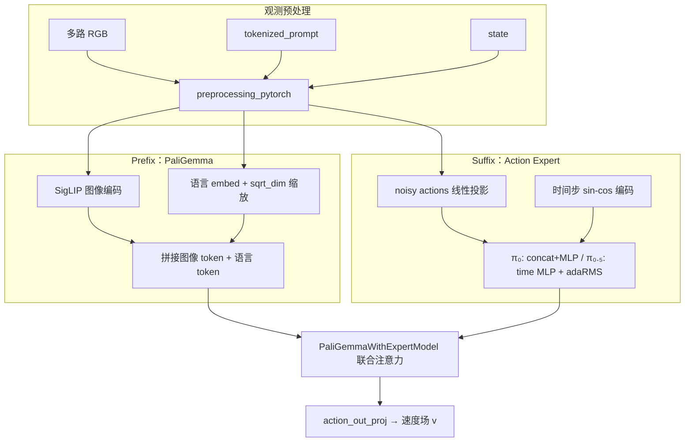

# OpenPI 中 π₀ / π₀.₅ VLA 模型（`models_pytorch` / `pi0_pytorch`）

本文基于 **[openpi](https://github.com/Physical-Intelligence/openpi)** 仓库中的 PyTorch 实现，入口为 **`src/openpi/models_pytorch/pi0_pytorch.py`** 中的 **`PI0Pytorch`**。配置类型为 **`openpi.models.pi0_config.Pi0Config`**，其中布尔字段 **`pi05`** 区分 **π₀** 与 **π₀.₅** 两套行为。

> **说明**：该代码树默认不在 llmOnEdge 子模块内；本地路径示例：`/home/zhangxa/codes/openpi`。下文路径均相对于 openpi 仓库根目录。

---

## 1. 这类 VLA 在做什么

**VLA（Vision-Language-Action）** 在这里指：在**一次前向**中联合使用

- **多相机图像**（视觉），
- **自然语言指令**（经 tokenizer 后的离散 token），
- **机器人状态**（低维向量；π₀ 与 π₀.₅ 的接入方式不同），

预测**一段未来动作轨迹**（连续值），形状为 **`[B, action_horizon, action_dim]`**。

与「只输出语言」的 VLM 不同，**动作头**不是 softmax 词表，而是对**连续动作序列**做 **flow matching（流匹配）** 式的回归：训练时预测噪声/速度场，推理时用 **ODE 式多步积分** 从噪声积分到动作。

---

## 2. 模块结构与数据流（总览）

核心类：

| 组件 | 文件 | 作用 |
|------|------|------|
| **`PI0Pytorch`** | `models_pytorch/pi0_pytorch.py` | 观测嵌入、suffix 嵌入、训练 loss、推理 `sample_actions` |
| **`PaliGemmaWithExpertModel`** | `models_pytorch/gemma_pytorch.py` | **PaliGemma**（视觉 + 语言）与 **Gemma Expert**（动作序列）**层间共享一次注意力** |
| **预处理** | `models_pytorch/preprocessing_pytorch.py` | resize、增广、mask、保留 token/state |

---

## 3. 双塔 + 联合注意力（与纯串联 VLM 的差异）

`gemma_pytorch.py` 在 **`inputs_embeds` 两路都非空** 时，对**每一层**：

1. 分别对 **PaliGemma 语言塔** 与 **Gemma Expert** 计算 Q/K/V；
2. **在序列维拼接** Q、K、V，做 **一次** `eager_attention_forward`（带统一 `attention_mask` / 位置编码）；
3. 将注意力输出按长度切回两路，各自 **o_proj、门控残差、MLP**。

因此 **图像 + 语言 token** 与 **动作相关 token** 在每一层都可以**相互注意**（具体可见性由 **2D attention mask** 约束，见下节）。  
推理时为降低重复计算，`sample_actions` 对 **prefix** 先 **`use_cache=True`** 算好 **KV cache**，再在每一步 denoise 里只对 **suffix** 前向并复用 cache。

---

## 4. Prefix / Suffix 与注意力模式

### 4.1 Prefix：`embed_prefix`

- 多路图像：经 **`paligemma_with_expert.embed_image`**（内部 `get_image_features`）得到 patch token。
- 语言：`embed_language_tokens`，并乘以 \(\sqrt{d}\)（与 Gemma 常见缩放一致）。
- 图像侧 `att_masks` 全 **0**：图像 token **互相全连接**。
- 语言侧同样 **0**：与图像 **双向全连接**（prefix 内部无因果遮挡）。

### 4.2 Suffix：`embed_suffix`

- **时间**：`create_sinusoidal_pos_embedding(timestep, width, min_period=4e-3, max_period=4.0)`，标量 \(t \in (0,1]\) 扩成向量。
- **动作**：`action_in_proj(noisy_actions)`，形状对应 **`action_horizon`** 个 token。

**π₀（`pi05=False`）**

- 将 **state** 经 **`state_proj`** 变成 **1 个连续 token** 接入 suffix（带 padding mask）。
- **时间** 与 **动作嵌入** 在特征维 **concat**，再经 **`action_time_mlp_in/out`**（SiLU）融合。
- Expert 侧 **不使用 adaRMS**（`use_adarms=[False, False]`）。

**π₀.₅（`pi05=True`）**

- **不再**把 state 作为 suffix 里的连续 token（配置说明 state 改经 **离散语言 token** 侧处理，由数据管线/分词配置配合，见 `Pi0Config` 注释）。
- 时间经 **`time_mlp_in/out`** 得到 **`adarms_cond`**，供 Expert 的 **adaRMSNorm** 注入 flow-matching 时间（`use_adarms=[False, True]`）。
- suffix 序列主体仍是 **动作 horizon** 个 token。

**对 prefix 的可见性（att_masks 语义）**  
`make_att_2d_masks`（源自 big_vision）用 **累积 `att_masks`** 构造 2D mask：

- suffix 里 **第一条动作 token** 对应位置为 **1**，其后 **action_horizon−1** 个为 **0**：实现动作序列上的 **因果**（后一步不看未来动作 token）。
- π₀ 里 state token 与第一条动作之间同样通过 mask 约束，使 **图像/语言不能 attend 到 state/动作**（前缀不「偷看」动作侧）；动作侧可通过后续联合注意力利用 prefix 的 K/V。

---

## 5. 训练：`forward`（flow matching）

1. 采样噪声 **`noise`**、时间 **`time`**（Beta 分布仿射到 \((0,1)\)）。
2. 构造插值：**`x_t = t * noise + (1-t) * actions`**，目标向量场 **`u_t = noise - actions`**。
3. 拼 prefix/suffix，**整段联合前向**，取 Expert 输出最后 **`action_horizon`** 个位置，**`action_out_proj`** 得 **`v_t`**。
4. Loss：**`MSE(u_t, v_t)`**（elementwise，无 reduction 聚合由外部决定）。

即：模型在学习 **给定观测与时间 t 下的去噪速度/流场**，与扩散/流匹配类策略一致。

---

## 6. 推理：`sample_actions`

1. **预处理** 观测（`train=False`：通常不做随机增广）。
2. **Prefix 一次前向**：`inputs_embeds=[prefix_embs, None]`，`use_cache=True`，得到 **`past_key_values`**（图像+语言冻结）。
3. 初始化 **`x_t = noise`**，**`time` 从 1.0 以步长 `dt = -1/num_steps` 走到 0**（默认 **`num_steps=10`**）。
4. 每步调用 **`denoise_step`**：
   - 仅用 **suffix 嵌入** 与 **上一步的 `x_t`、当前标量 time**；
   - 注意力 mask 为：**prefix 区域对 suffix 可见**（`prefix_pad_2d_masks` 与 suffix 内因果 mask 拼接），**position_ids** 在 prefix 长度上续写；
   - **`inputs_embeds=[None, suffix_embs]`**，`past_key_values` 传入联合模块；
   - 输出经 **`action_out_proj`** 得 **`v_t`**。
5. **Euler 更新**：**`x_t = x_t + dt * v_t`**，直至时间越过 0。
6. 返回最终 **`x_t`** 作为 **`[B, action_horizon, action_dim]`** 动作块。

为兼容 KV cache，代码将 **PaliGemma** 与 **Expert** 的 attention 实现设为 **`eager`**（避免某些 flash 路径与 cache 不兼容）。

---

## 7. 观测预处理要点（`preprocessing_pytorch.py`）

- 默认图像键：**`base_0_rgb` / `left_wrist_0_rgb` / `right_wrist_0_rgb`**，分辨率 **224×224**；支持 **NCHW / NHWC**，统一 resize（pad）到固定分辨率。
- **训练**时：可颜色/对比度/饱和度增广，非 wrist 相机可做随机裁剪与小幅旋转；数值会从 **`[-1,1]`** 与 **`[0,1]`** 之间切换以适配增广。
- **mask**：若 `observation` 未提供某键的 `image_masks`，默认为全 **True**（不屏蔽）。

---

## 8. π₀ 与 π₀.₅ 对比小结

| 项目 | π₀ (`pi05=False`) | π₀.₅ (`pi05=True`) |
|------|-------------------|---------------------|
| **State** | Suffix 中 **连续 `state_proj` token** | 配置语义：**state 走离散语言侧**（与 tokenizer/数据配置配合） |
| **时间注入** | 与动作 embed **concat + MLP** | **time MLP → adaRMS 条件**（仅 Expert） |
| **`use_adarms`** | `[False, False]` | `[False, True]` |
| **`max_token_len` 默认** | 48 | 200（`Pi0Config.__post_init__`） |
| **`discrete_state_input` 默认** | False | True |

实现上 **`PI0Pytorch`** 是**同一类**，由 **`config.pi05`** 分支决定模块结构与 `embed_suffix` 行为。

---

## 9. 依赖与工程注意

- **Transformers 补丁**：`PI0Pytorch.__init__` 要求将 `models_pytorch/transformers_replace/` 覆盖安装到 **`transformers` 包**（并配合 **`transformers==4.53.2`**），否则 SigLIP/Gemma/PaliGemma 的修改版行为不一致。
- **精度**：广泛 **bfloat16**，部分 layernorm/embedding 仍 **float32**（`to_bfloat16_for_selected_params`）。
- **`torch.compile`**：可对 **`sample_actions`** 按 `pytorch_compile_mode` 编译（默认 `max-autotune`），部署时需单独验证与 KV cache、eager attention 的组合。

---

## 10. 与 llmOnEdge 的关系

llmOnEdge 当前主线是 **TensorRT-Edge-LLM / 端侧 LLM 服务**；本文档仅整理 **openpi VLA** 的 PyTorch 结构与推理流程，便于对照「**多模态 + 连续动作 + 流匹配**」与纯文本 LLM 推理的差异。若要做端侧部署，见 **[pi05-trt-deploy.md](./pi05-trt-deploy.md)**（混合运行时、Edge-LLM 适用边界与分阶段路线）。

---

## 11. 关键源文件索引

- `src/openpi/models_pytorch/pi0_pytorch.py` — **`PI0Pytorch`**
- `src/openpi/models_pytorch/gemma_pytorch.py` — **`PaliGemmaWithExpertModel`**
- `src/openpi/models_pytorch/preprocessing_pytorch.py` — **`preprocess_observation_pytorch`**
- `src/openpi/models/pi0_config.py` — **`Pi0Config`**（`pi05`、`action_horizon`、`action_dim` 等）
