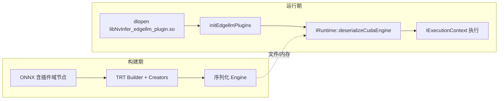

# TensorRT-Edge-LLM 自定义插件（`cpp/plugins`）

本文说明上游 **`third_party/TensorRT-Edge-LLM/cpp/plugins`** 目录的职责、各子模块作用，以及在 **TensorRT-Edge-LLM / llmOnEdge** 中的典型使用方式。路径均相对于 llmOnEdge 仓库根目录。

---

## 1. 在整体架构中的位置

Edge LLM 的 **ONNX 导出** 会把部分算子（注意力、INT4 GEMM、Mamba 等）映射为 **TensorRT 自定义插件节点**；**TensorRT Builder** 在解析图时通过 **Plugin Creator** 实例化插件；**引擎序列化** 后，**运行时** 在反序列化引擎前必须把 **插件动态库** 加载进进程，否则无法解析图中对应层。

- **实现代码**：`cpp/plugins/**/*.cpp` + 对应头文件；**内核实现**多在 `cpp/kernels/`（插件 `enqueue` 内 dispatch 到 CUDA）。
- **产物**：CMake 目标 **`NvInfer_edgellm_plugin`** → 共享库（默认名形如 **`libNvInfer_edgellm_plugin.so`**，输出在构建目录，见 `cpp/CMakeLists.txt` 中 `LIBRARY_OUTPUT_DIRECTORY`）。
- **链接关系**：插件目标链接 **`edgellmKernels`**、**`commonLibraryExt`**（TensorRT + CUDA），与 **`edgellmCore`** 解耦，供运行时可按需 `dlopen`。

---

## 2. 构建系统如何编进插件

在子模块根目录的 `cpp/CMakeLists.txt` 中：

- 使用 `file(GLOB_RECURSE PLUGIN_CPP_SRCS "plugins/*.cpp")` 收集所有插件源文件；
- `add_library(NvInfer_edgellm_plugin SHARED ${PLUGIN_CPP_SRCS})`；
- 为 FMHA 等按 SM 裁剪的宏：`FMHA_EXCLUDE_DEFINITIONS`；
- 若开启 **`ENABLE_CUTE_DSL_FMHA`**，**`CuteDslFMHA.cmake`** 还会向 **`NvInfer_edgellm_plugin`** 注入 Blackwell CuTe DSL FMHA 相关产物（与 `edgellmKernels` / `edgellmCore` 协同）。

因此：**改插件代码后需重新编译该 .so**；换引擎文件时需保证 **插件版本与导出 ONNX/构建链一致**。

---

## 3. 目录与子模块一览

| 子目录 | 作用概要 |
|--------|-----------|
| **`utils/`** | 公共工具：`pluginUtils.h/.cpp`（字段解析、序列化模板、workspace 对齐分配等）；**导出符号 `initEdgellmPlugins`**，供宿主在 `dlopen` 后同步日志级别。 |
| **`attentionPlugin/`** | **LLM 上下文/解码注意力**（含 KV Cache、可选 **EAGLE 树注意力**、**FP8 KV**、**滑动窗口** 等）。接口为 **`IPluginV2DynamicExt`**。注册名：**`AttentionPlugin`**。 |
| **`vitAttentionPlugin/`** | **ViT 多模态**等场景下的注意力变体。同样 **`IPluginV2DynamicExt`**。注册名：**`ViTAttentionPlugin`**（与 LLM Attention 名称区分）。 |
| **`int4GroupwiseGemmPlugin/`** | **INT4 分组量化 GEMM**，用于权重矩阵乘等。接口为 **`IPluginV3`** 系列。注册名：**`Int4GroupwiseGemmPlugin`**。 |
| **`int4MoePlugin/`** | **INT4 MoE**（多专家 + top-k 等）。**`IPluginV3`**。注册名：**`Int4MoePlugin`**。 |
| **`mamba/mambaPlugin.*`** | **Mamba SSM 状态更新**（`update_ssm_state`，与 ONNX 域文档一致）。**`IPluginV3`**。 |
| **`mamba/causalConv1dPlugin.*`** | **Mamba 因果 1D 卷积**辅助算子。注册名：**`causal_conv1d`**。 |

各 Creator 在对应 `.cpp` 末尾使用 TensorRT 宏 **`REGISTER_TENSORRT_PLUGIN(...)`** 完成全局注册；**插件命名空间**由 Creator 在运行时设定，与 ONNX 导出中的 **plugin domain** 一致（通常为项目约定的 **`trt_edgellm`** 域，具体以导出脚本与 Creator 为准）。

---

## 4. 运行期使用方式（与 llmOnEdge 一致）

### 4.1 加载共享库

应用侧通过 **`trt_edgellm::loadEdgellmPluginLib()`**（`cpp/common/trtUtils.h`）：

1. **`dlopen`** 打开 `libNvInfer_edgellm_plugin.so`；
2. 若存在导出函数 **`initEdgellmPlugins`**，则以 **`ILogger*`** 调用，使插件内日志级别与宿主一致。

**库路径：**

- 环境变量 **`EDGELLM_PLUGIN_PATH`**：指向 .so 的完整路径（推荐生产环境显式设置）；
- 未设置时，默认字符串 **`build/libNvInfer_edgellm_plugin.so`**（相对当前工作目录，适合在构建树旁运行示例）。

**llmOnEdge**：`src/openai_server/llm_session.cpp` 在构造 **`LlmEngineSession`** 前通过 **`ensurePluginsLoaded()`** 间接完成上述逻辑（与官方 **`llm_inference`** 示例一致）。

### 4.2 调用顺序约束

必须在 **`IRuntime::deserializeCudaEngine`**（或从文件加载 engine）**之前** 完成插件库加载与 `initEdgellmPlugins`；否则反序列化阶段无法还原自定义层。

### 4.3 与 `edgellmCore` 的关系

- **插件 .so**：提供 TensorRT **图上的自定义层实现**；
- **`edgellmCore`**：运行时 **编排**（如 `LLMInferenceRuntime::handleRequest`）、张量与采样等；
- 二者通过 **引擎内嵌的插件类型名 + 命名空间 + 序列化参数** 衔接，**不是**编译期静态链接到同一可执行文件（宿主仍链接 `edgellmCore` 做推理循环）。

---

## 5. `utils/pluginUtils` 要点

- **`kDEVICE_ALIGNMENT`（128）**：设备侧 workspace/张量对齐；
- **`parsePluginScalarField`**：从 **`PluginFieldCollection`** 读标量配置；
- **`Serializer<T>`**：插件参数序列化/反序列化辅助；
- **`accumulateWorkspaceSize` / `assignTensorFromWorkspace`**：在 **`enqueue`** 中从一块 workspace 连续切分临时张量；
- **`applyThorSMRenumberWAR`**：Thor 等平台上 SM 编号与内核 cubin 选择的兼容处理。

---

## 6. 扩展与调试建议

- **新增插件**：在 `plugins/` 下增加实现 + Creator + `REGISTER_TENSORRT_PLUGIN`，并确保 **ONNX 导出** 使用相同 **plugin name / version / namespace**；导出与文档见上游 **`docs/source/developer_guide/customization/tensorrt-plugins.md`**。
- **黑盒引擎**：若只有 `.plan`/`.engine` 而无 ONNX，可用 TensorRT API 打印引擎层信息，对照本文 **注册名字符串** 确认依赖哪些插件。
- **多进程/多实例**：每个进程需各自 **`dlopen`**（或链接方式等价加载），**不要**在未序列化保护下多线程并发加载同一插件句柄以外的资源（具体以 TensorRT 与宿主线程模型为准）。

---

## 7. 相关文档

- 本仓库总览：[trt-edge-llm.md](trt-edge-llm.md)
- INT4 group-wise GEMM/GEMV 内核：[int4GroupGemm.md](int4GroupGemm.md)
- CuTe DSL FMHA 与内核侧集成：[fmha_aot.md](fmha_aot.md)
- 上游开发者指南（子模块内）：`third_party/TensorRT-Edge-LLM/docs/source/developer_guide/customization/tensorrt-plugins.md`
